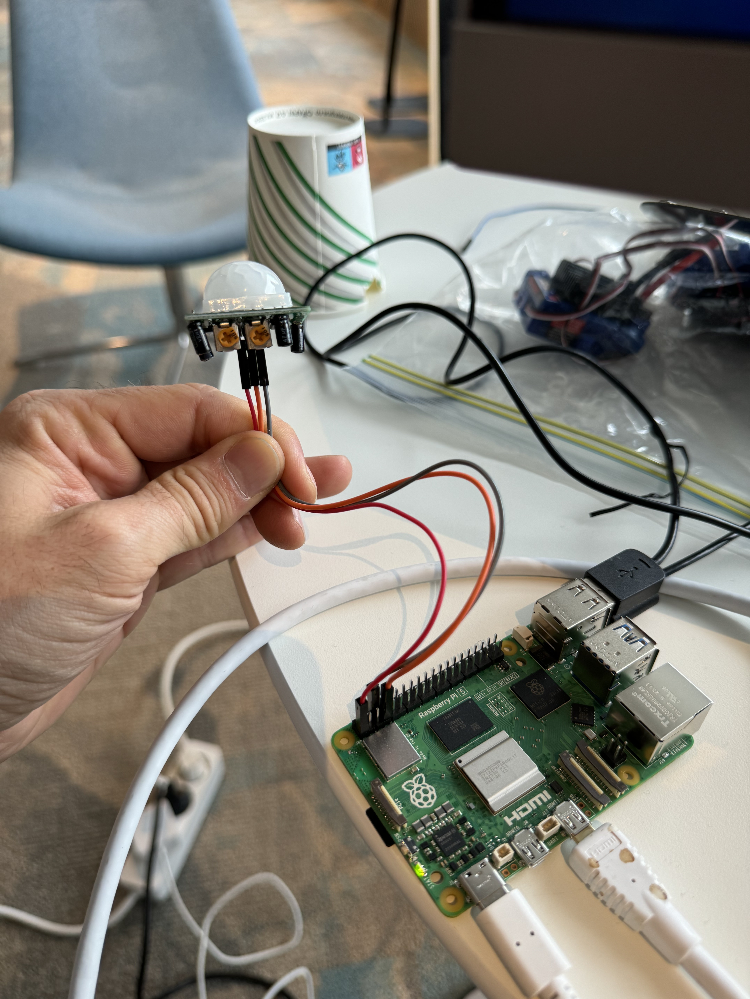
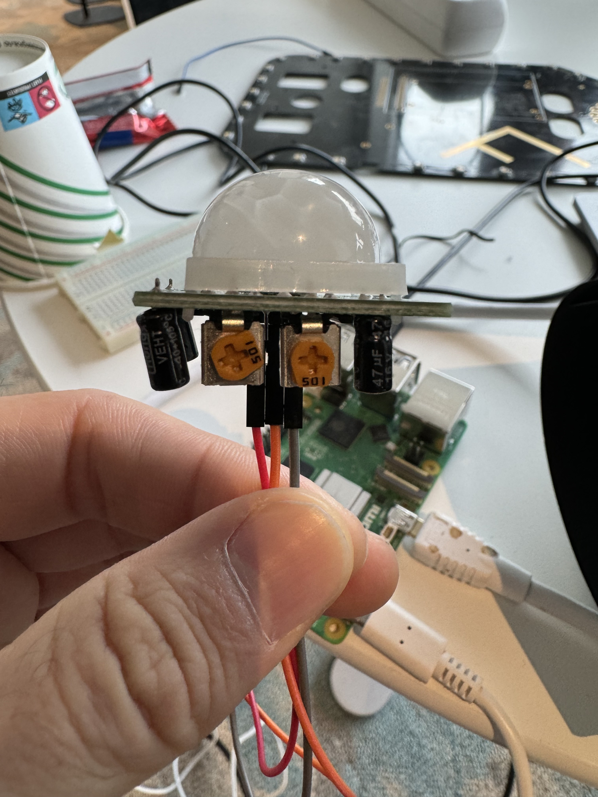
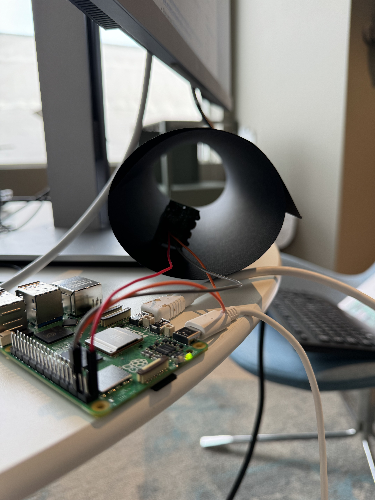

# PIR sensor

Bruker gpiozero biblioteket for å lese av

## Bruk
Fra eksempelbildene er rød ledning koblet til 3.3v, grå til GND og oransje til GPIO 4 (pin nr 7).
Dette skal stemme overrens med koden i eksempelet også.

Etter diverse prøving og feiling endte vi opp med disse innstillingene for å få sensoren til å fungere.  
Da er sensitivitet satt til nøytral, og tidsforsinkelse er satt helt ned.

Tips til testing er å lage en la sensoren ha begrenset område å observere, for å unngå støy med bevegelse i rommet.  
Vi rullet sammen et ark for å lage en tunnel med en åpning foran sensoren.

